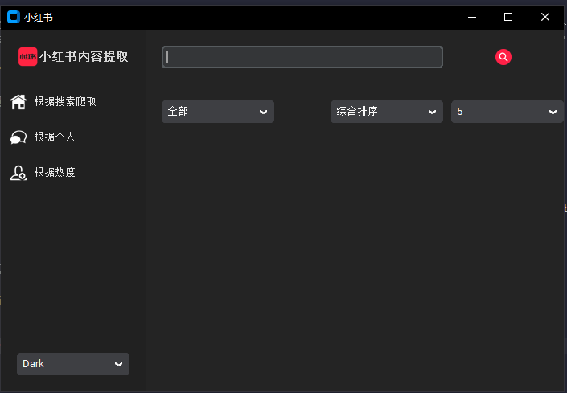

> **免责声明：**

> 本仓库的所有内容仅供学习和参考之用，禁止用于商业用途。任何人或组织不得将本仓库的内容用于非法用途或侵犯他人合法权益。本仓库所涉及的爬虫技术仅用于学习和研究，不得用于对其他平台进行大规模爬虫或其他非法行为。对于因使用本仓库内容而引起的任何法律责任，本仓库不承担任何责任。使用本仓库的内容即表示您同意本免责声明的所有条款和条件。

# 仓库描述 🌈

**小红书爬虫**
稳定抓取小红书的视频、图片、评论、点赞、转发等信息。

原理：利用网页登录成功后的 cookie 进行接口请求，传递对应参数获取数据。
<p align="center">
  <br>
  
  <br>
  <br>
</p>

## 依赖库 🎨

- [customtkinter](https://customtkinter.tomschimansky.com/) - A modern and customizable python UI-library based on Tkinter

## 进行中 🎉

- [x] 可视化界 UI 面

## 项目代码结构 🫧

```
MediaCrawler
├── assets                # 静态资源文件
└── UI.py                 # UI界面
```

## 打包🫧

```
pyinstaller --add-data 'static/*;static' --add-data 'assets/icons/*;assets/icons' --add-data 'assets/theme/*;assets/theme'  RedBookSpider.py
pyinstaller --add-data 'static/*;static' --add-data 'assets/icons/*;assets/icons' --add-data 'assets/theme/*;assets/theme' -w  RedBookSpider.py
```
